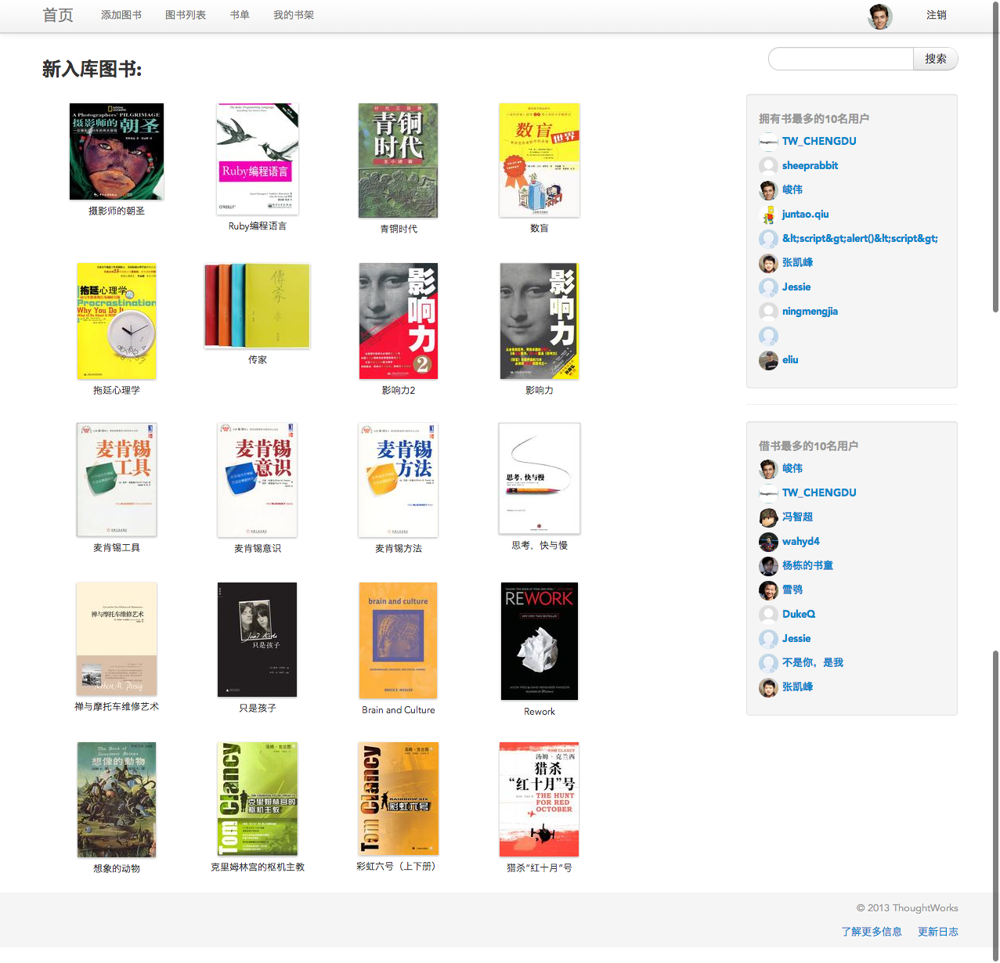

Libr
====
   
tw-libr 是一个用户分享、借阅、管理、展示图书的小应用，目前正在为Thoughtworks Chengdu 办公室服务。我们正不断地为更好的方便同事借书而升级改造Libr。后期我们希望Libr 可以为公开为所有用户服务。
目前已经有成都办公室同事[hoverruan][1]和 [xiaoboa][2]分别为Libr开发Android和IOS客户端。ma  

Screen shot:
====  

Build Status
====

#### Export System variable

        export CLIENT_ID=***
        export CLIENT_SECRET=***
        export REDIRECT_URI=***

        export QQ_CLIENT_ID=***
        export QQ_CLIENT_SECRET=***
        export QQ_REDIRECT_URI=***

#### 移动平台客户端

* [Android][3]
* [IOS][4]

#### 更新日志
 * 2013.2.17 添加个人信息编辑，设置昵称、电子邮箱、所在城市
 * 2013.2.17 添加API KEY 为后期在微信上借书、查询等做准备
 * 2013.2.17 为图书列表添加分页功能
 * 2013.2.18 添加基本API：图书信息、用户信息、图书列表
 * 2013.2.18 添加Auth key 功能，用户可以生成自己的key
 * 2013.2.19 用户可以删除自己的key
 * 2013.2.21 添加图书搜索API
 * 2013.2.26 添加归还已经借阅图书的API
 * 2013.2.27 修改借书逻辑，由之前的系统自动查找合适人选，变为借书者自行选择合适的拥有书者。修改bookinfo API增加返回所有当前可借的实例信息
 * 2013.2.28 添加私有书籍选项，用户在添加书籍是可以设置书籍为私有书籍，私有书籍他人不可见，仅用户自己可见
 * 2013.3.11 添加用户书籍API
 * 2013.4.15 添加历史记录
 * 2013.4.16 开始添加微信公共账号feature

#### JSON API使用指南

        * GET /api/userinfo/:user_id 用户用户的相关信息
        * GET /api/bookinfo/:isbn  需要传入书籍的13位ISBN号，获取书籍的相关信息，拥有书籍的用户，和当前所有可借的用户信息
        * GET /api/books  以列表形式获取图书信息，每页10条信息，如要获取第二页信息地址则为 /api/books/?page=2,依次类推
        * GET /api/users/:user_id/books 以列表的形式获取某个用户的图书信息，使用方式和/api/books 类似
        * GET /api/book/search/:keyword 图书搜索，最多返回20条相关记录
        * POST /api/auth 客户端使用auth key,进行验证登录，验证成功后，可以使用该key,进行所有需要认证的操作。
          必填参数key,auth在用户中心，点击小锁图片即可进入KEY管理页面。(KEY不区分大小写)
        * POST '/api/books/add', 添加图书，必须填入图书的ISBN(isbn),和Auth key(key),Is public是否公开，
          可选参数为true,false(is_public)。括号为传递参数的实际名称
        * POST '/api/book/return' 归还已经借阅的图书，必需参数Auth key(key),Book binstance id(instance_id )
        * POST '/api/books/borrow' 借阅图书，必需参数Auth key(key),Book binstance id(instance_id )

#### Road map:
* 移动客户端的支持，用户可以在手机上查找图书，通过扫描二维码添加图书。
* 用户长时间借书未归还，自动提醒（邮件、微信？）
* 微信查书？
* 用户私有书架，用户可以选择不对外公开展示自己的书籍，只供自己查看。
* 为用户添加 组织、地址标签，方便借书与分享书时，选择最优方案。
* 用户可以创建书单，书单为一系列书的集合。如：java程序员必读的10本书。
* 用户可以选择开始读某一书单。并可以看到自己读这一书单的进度，以及需要向那些人借书，以及看到有多少其他人已经读了这个书单等等统计。用户读完书单，可以发布感想。如果扯远来：有书单，也就可以有 各种进度、统计、勋章、虚拟奖励等等。
* 各种深入的数据统计。如：某用户平均借书周期、哪段时间看书较多等等......
* ....... 等你们来补充

#### License
        The MIT License (MIT)

[1]:https://github.com/hoverruan
[2]:https://github.com/xiaoboa
[3]:https://github.com/hoverruan/libr-android
[4]:https://github.com/xiaoboa/Libr-client
